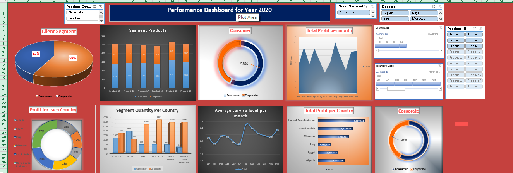

# Performance Dashboard - 2020 Analysis

## 📊 Project Overview
An interactive data dashboard designed to analyze and visualize business performance throughout the year 2020. This tool provides deep insights into sales, profit distribution, and customer behavior across different regions.

## 🚀 Key Insights & Features
- **Client Segmentation:** Analyzed revenue split between Consumer (58%) and Corporate (42%) segments.
- **Geographical Performance:** Visualized total profit and quantity per country including Egypt, UAE, Saudi Arabia, Algeria, Iraq, and Morocco.
- **Monthly Trends:** Tracked total profit and average service levels on a monthly basis to identify seasonal patterns.
- **Product Analysis:** Detailed breakdown of product categories (Electronics & Furniture).
- **Interactivity:** Integrated dynamic slicers for real-time data filtering by date, country, and product ID.

## 🛠️ Tools Used
- Microsoft Excel (Advanced Data Visualization / Pivot Tables / Slicers)
- Data Cleaning & Transformation.
